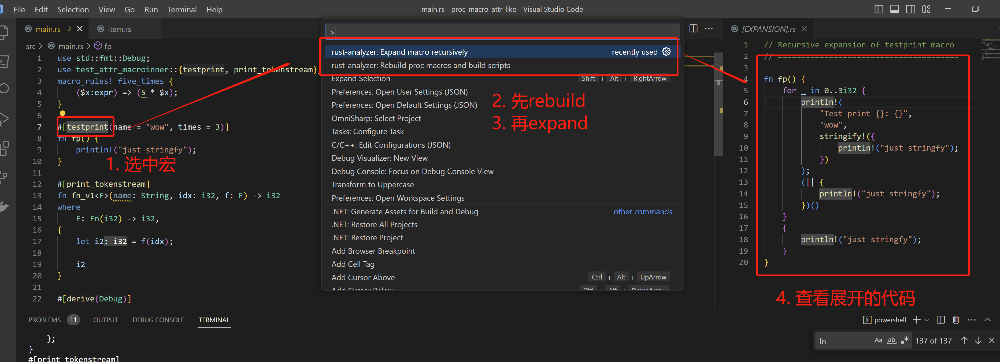

### 调试宏

直接使用 rust-analyzer 中的宏展开功能

1. 选择某个函数展开的宏, 在vscode中, 选中testprint, 然后按住 
- Ctrl + Shift + P => rust-analyzer: Rebuild proc macros and build scripts
- Ctrl + Shift + P => rust-analyzer: Expand macro recursively
即可看见展开的代码
```rust
#[testprint(name = "wow", times = 3)]
fn fp() {
    println!("just stringfy");
}
```

2. 